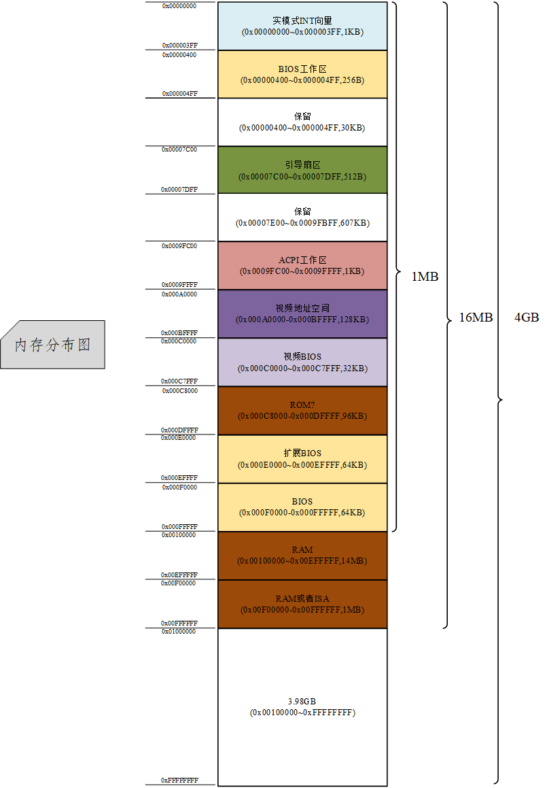
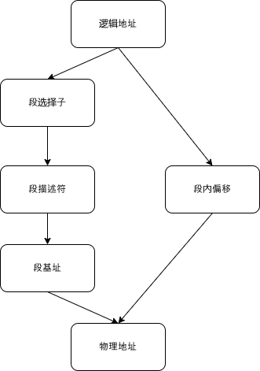

# 第04天：C语言与画面显示练习
## 电脑启动过程
1. 按下开机键通电；
2. BIOS启动并自检，以legacy或者UEFI方式启动硬件修通；
3. BIOS读取硬盘/软盘/光驱的第一个扇区(512字节)到内存`0x7c00~0x7dff`处；
4. 执行`0x7c00-0x7dff`代码启动相应的操作系统。

其中这512字节的程序就叫做bootloader，学习过程中这里叫做IPL（initial program loader）。总之，开机之后会执行这512字节的指令，这512字节的指令再去将操作系统内核（OS kernel）加载到内存当中，然后启动真正的操作系统。

## BIOS
BIOS是基本输入输出系统，由于BIOS是16位汇编语言程序，所以只能运行在16位实模式，最大访问内存为2^16/(2^8*2^8)=1MB，特别是UEFI是32位或64位高级语言程序，突破实模式限制就可以达到要求的最大寻址。

## 从汇编语言到C语言
整个启动过程需要经过下面几个步骤
1. 通过Makefile将源代码生成软盘镜像文件；
2. 插入软盘，开机通电（以虚拟机或者qemu虚拟机中执行）；
3. BIOS自动加载首扇区的512字节并且调用其启动程序(ipl.S)；
4. 启动程序将软盘内容加载到内存并且跳转到指定地址执行(ipl.S)；
5. 从16位实模式转换到32位保护模式(hello.S)；
6. 执行C语言入口函数(bootpack.c)。

## 32位操作系统内存分布示意图
通过回顾上述操作，我们可以得到32位条件下，内存分布范围图

内存分布图

## 内存访问

### 16位实模式
一般地，程序代码分为代码段、数据段等，所有的内存寻址都是根据（段基址：段内偏移）来访问，这种地址形式被称作是逻辑地址。
由于8086处理器字长只有16位，所以这种方式下只能进行64KB寻址，但是通过以（段基址：段内偏移）这种方式来扩展寻址空间，即：

> 物理地址 = 段基址 << 4 + 段内偏移

CPU访问内存前，会先经过段部件，按照上面的公式，计算出真正的物理地址，这样两个16位寄存器合在一起，便有了20位物理地址，这样内存访问的范围扩展到2^20bit=1MB。

但是这种访问模式有缺点，即程序可以随意访问任何物理地址，所以这样就催生出了保护模式。

### 32位保护模式
在保护模式情况下，段寄存器并不是直接存放在段基址，而是存放在段选择子。

段描述符是用来描述一个段的信息，长度位64位，其中有32位用于存放段基址，剩下32位存放着段界限等信息。

段描述符存放在GDT表中，即全局描述符表，全局描述符表会存放着所有的段描述符，也有LDT。

记录GDT地址方式如下所示：

> lgdt [GDT地址]

执行以上的指令，那么CPU则会记录下GDT地址，并且将其存放到GDTR寄存器当中。

总之，保护模式下的寻址方式如下所示：

1. 段寄存器存放段选择子；
2. CPU根据段选择子从GDT中饭找到对应段描述符；
3. 从段描述符当中取出段基址；
4. 根据之前的公式，结合段基址和段内偏移地址，计算出物理地址。

物理地址寻址方式是通过以下的方式进行寻址

上述方式是分页基址未开启的情况下寻址过程，若开启了分页基址，那么第三步计算出来的就是线性地址需要经过页表部件转换成物理地址。左边是32位保护模式寻址方式，右边是实模式状态下寻址方式。

开启保护模式，则需要将CR0控制寄存器中的标志位打开就可以，并且还需要准备好保护模式所需要的一些数据，例如上述所说的全局描述符表，然后直接跳往某个构建好的段选择子，就完成了实模式向保护模式的跳跃。

### IA-32e模式

64位寄存器则是出现了一种称为IA-32e模式的寻址方式，这里做简单的介绍，它基于32位保护模式，通过段选择子、段描述符等来寻址的，但是与其不同的是，所有段描述符中的段基址都是0，段长度都是可寻址的最大长度，这种情况下段内偏移量直接就等于线性地址，无需经过公式计算。

### 特权级

寻址方式还有分级别方式，即特权分级。特权一共有四层，0是最高特权级，是用于内核代码所运行的级别，3则是最低特权级，是用户程序所运行的级别。

段描述符中会记录访问当前段所需要的特权级，程序在访问一个段时候需要先构建段选择子，段选择子中有两位专门负责表示当前程序请求访问目标段的时候特权级，即为RPL。一般来说，RPL=CPL，CPL即位当前程序所在代码的特权级，存放在CS寄存器中的后两位。（CS寄存器存放的就是当前代码段的段选择子）

目标段的特权级被称为DPL，当程序访问目标段的时候，如果DPL特权比CPL和RPL中任何一个高，那么就会拒绝访问，从而起到了保护作用。

